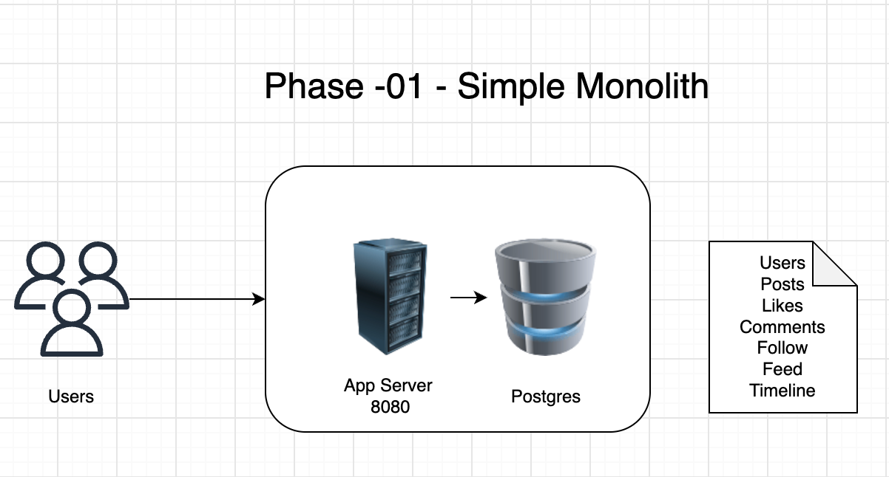
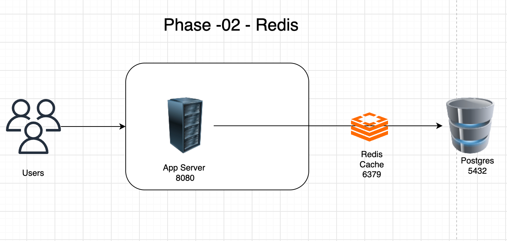
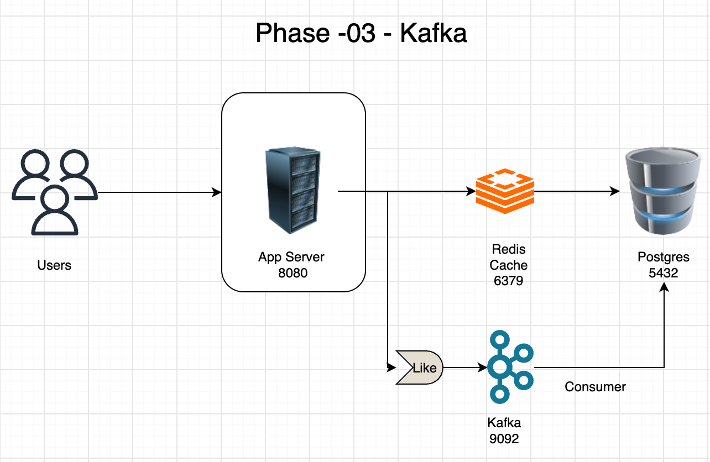
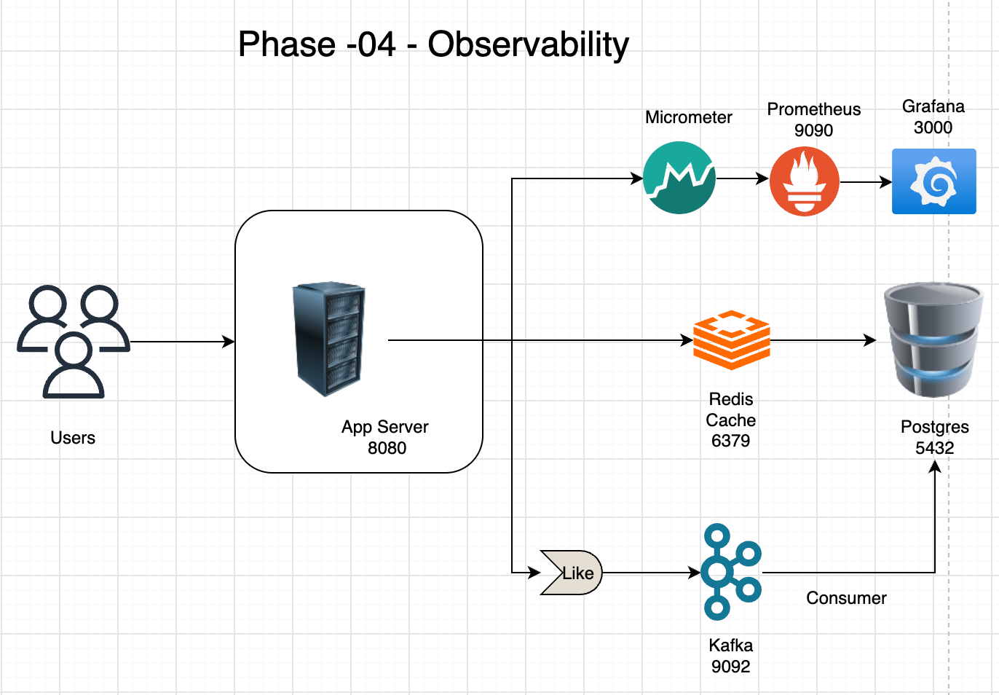
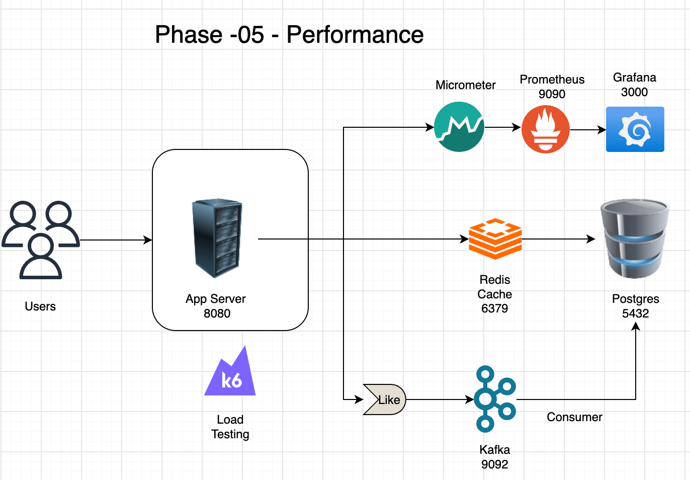
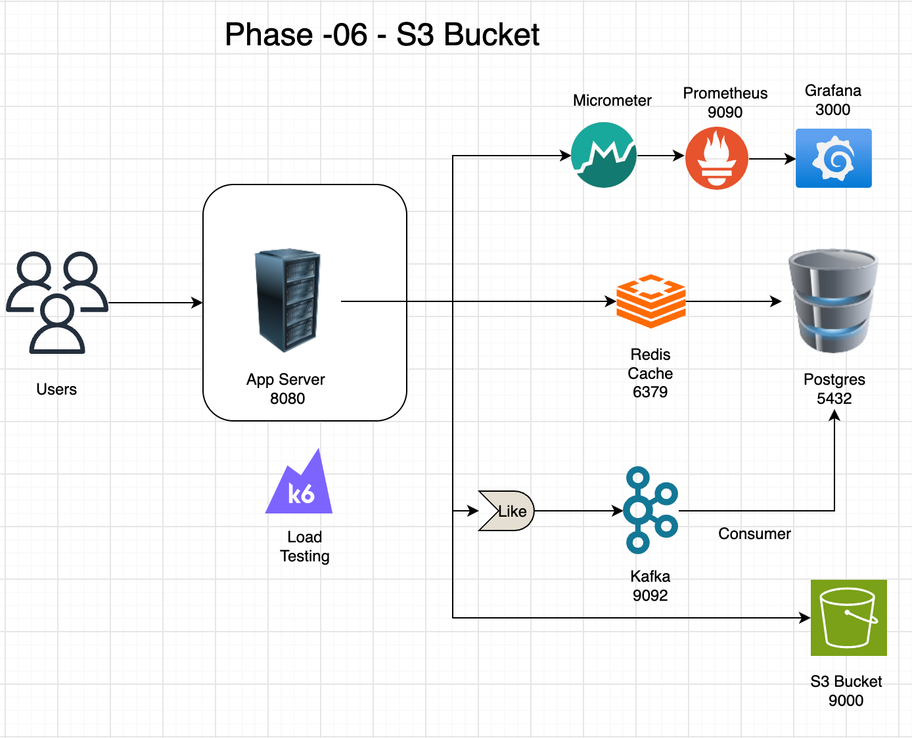
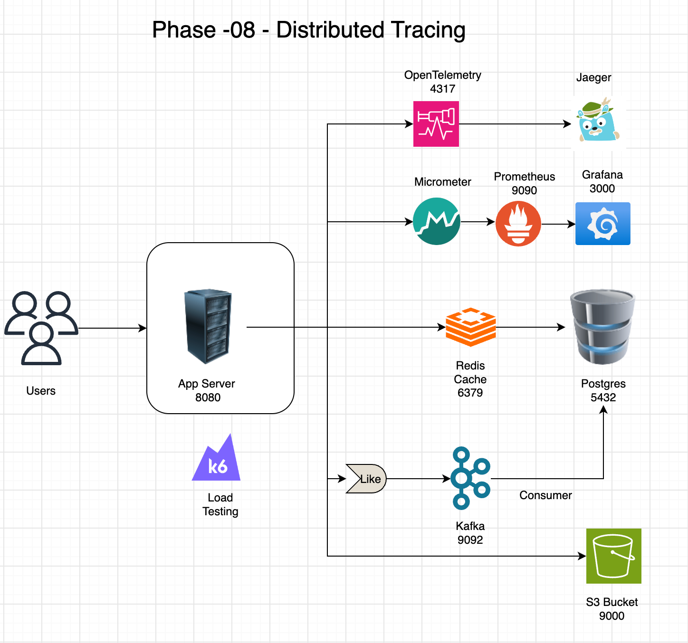

# Photo Sharing System Design Lab: Architecture Evolution Journey

## Project Name

`photo-sharing-system-design-lab`

## Purpose

This project is not just a photo-sharing application.

It is a practical system design lab that demonstrates how a backend platform evolves step by step as traffic, reliability, performance, storage, observability, and deployment needs grow.

The core learning principle of this project is:

```text
Experience the problem first.
Introduce the solution second.
```

Instead of starting with a complex distributed architecture, the system starts as a simple monolith and introduces new components only when there is a clear architectural reason.

This mirrors how real production systems evolve.

---

## Technology Stack

```text
Java 21
Quarkus
PostgreSQL
Flyway
Redis
Redpanda / Kafka
MinIO
Micrometer
Prometheus
Grafana
OpenTelemetry
Jaeger
k6
Docker
Kubernetes using Kind
```

---

## Architecture Evolution Philosophy

The project follows an incremental architecture evolution model.

Instead of overengineering from the beginning, each phase answers one question:

```text
What problem are we facing now?
What component solves that problem?
What trade-off does that component introduce?
```

The high-level journey is:

```text
Monolith
  ↓
Caching
  ↓
Asynchronous Events
  ↓
Observability
  ↓
Performance Engineering
  ↓
Object Storage
  ↓
Microservice Boundary Design
  ↓
Distributed Tracing
  ↓
Kubernetes Runtime
  ↓
Kubernetes Platform Components
  ↓
Production Readiness
  ↓
Service Decomposition
```

---

# Phase-01: Core Monolith

## Problem

Build the simplest working version of a photo-sharing application.

At this stage, the priority is not scalability. The priority is to establish the core domain model and working business flows.

---

## Features Implemented

```text
Users
Posts
Likes
Comments
Follow
Feed
Timeline
```

---

## Architecture



---

## Key Learning

```text
Start simple.
Build the domain first.
Avoid premature microservices.
```

A monolith is not a bad architecture. A well-structured monolith is often the right starting point because it allows fast development, easier debugging, and simpler deployment.

---

# Phase-02: Redis Cache

## Problem

Feed generation can become expensive if every request repeatedly queries PostgreSQL.

As traffic increases, repeated database reads can become a bottleneck.

---

## Solution

Introduce Redis using the Cache Aside Pattern.

---

## Implemented

```text
Cache Aside Pattern
Feed Caching
Cache Metrics
```

---

## Architecture



---

## Request Flow

```text
Client requests feed
        ↓
Check Redis
        ↓
If cache hit, return cached feed
        ↓
If cache miss, query PostgreSQL
        ↓
Store result in Redis
        ↓
Return response
```

---

## Key Learning

```text
Not every request should hit the database.
Cache improves read performance.
Cache introduces invalidation complexity.
```

Redis was introduced only after understanding the database read pressure problem.

---

# Phase-03: Kafka Notifications

## Problem

When a user likes a post, the system may need to notify the post owner.

If notification logic runs synchronously inside the like API, the API becomes slower and more tightly coupled.

---

## Solution

Introduce Kafka / Redpanda for asynchronous event-driven processing.

---

## Implemented

```text
PostLikedEvent
Kafka Producer
Kafka Consumer
Notification Service
```

---

## Architecture



---

## Key Learning

```text
Synchronous work affects API latency.
Asynchronous events decouple producers and consumers.
Kafka helps introduce eventual consistency.
```

The like API can publish an event and return quickly, while notification handling happens independently.

---

# Phase-04: Observability

## Problem

The system works, but system behavior is not visible.

Without metrics, it is difficult to know:

```text
How many requests are served?
How many cache hits happen?
How many cache misses happen?
How slow are APIs?
How is the system behaving under load?
```

---

## Solution

Introduce metrics and dashboards.

---

## Implemented

```text
Micrometer
Prometheus
Grafana
Custom Metrics
```

---

## Architecture



---

## Key Learning

```text
You cannot improve what you cannot measure.
Metrics make system behavior visible.
Dashboards help validate architectural decisions.
```

---

# Phase-05: Performance Engineering

## Problem

The system needs to be tested under realistic load.

Without performance testing, capacity assumptions are only guesses.

---

## Solution

Introduce synthetic data generation and load testing.

---

## Implemented

```text
Synthetic Data Generation
k6 Load Testing
Benchmarking
```

---

## Architecture



---

## Key Learning

```text
Performance must be measured.
Load testing exposes bottlenecks.
Synthetic data helps simulate realistic scenarios.
```

---

# Phase-06: Object Storage

## Problem

Images should not be stored directly inside PostgreSQL.

Relational databases are good for structured metadata, but large binary files should be stored separately.

---

## Solution

Introduce MinIO as an S3-compatible object storage system.

---

## Implemented

```text
MinIO
Upload API
Presigned URLs
Feed Integration
Timeline Integration
```

---

## Architecture



---

## Key Learning

```text
Store metadata in PostgreSQL.
Store binary objects in object storage.
Use presigned URLs for secure upload/download flows.
```

This separates structured data from large file storage.

---

# Phase-07: Microservice Boundary Design

## Problem

The monolith is growing.

Before extracting services, the system needs clear logical boundaries.

---

## Solution

Identify future service boundaries without extracting them immediately.

---

## Future Service Boundaries

```text
User Service
Post Service
Feed Service
Notification Service
Media Service
```

---

## Architecture Thinking

```text
Current: Modular Monolith
Future: Extracted Services
```

Instead of prematurely creating microservices, this phase focuses on understanding ownership boundaries, data boundaries, and communication patterns.

---

## Key Learning

```text
Microservices should be discovered from domain boundaries.
Do not split services before understanding the domain.
A modular monolith is a strong stepping stone.
```

---

# Phase-08: Distributed Tracing

## Problem

Metrics show what happened, but they do not always explain why it happened.

As the system introduces Redis, Kafka, MinIO, and multiple internal operations, a single request may pass through several components.

---

## Solution

Introduce distributed tracing using OpenTelemetry and Jaeger.

---

## Implemented

```text
OpenTelemetry
Jaeger
Custom Spans
```

Custom spans included:

```text
feed-service
redis-cache-check
generate-presigned-url
like-post
publish-post-liked-event
notification-consumer
```

---

## Architecture



```text
Request
  │
  ▼
Trace
  │
  ├── API Handler
  ├── Feed Service
  ├── Redis Cache Check
  ├── PostgreSQL Query
  ├── MinIO URL Generation
  └── Kafka Event Publish
```

---

## Key Learning

```text
Metrics show aggregate behavior.
Traces show request journeys.
Tracing helps debug latency across boundaries.
```

---

# Phase-09: Kubernetes Foundations

## Problem

The application should be portable and run in a containerized orchestration environment.

Running locally is not enough to understand modern deployment patterns.

---

## Solution

Containerize the application and deploy it to Kubernetes using Kind.

---

## Implemented

```text
Kind Cluster
Docker Image
Kubernetes Deployment
Kubernetes Service
Port Forwarding
Rolling Deployment
Feed API Running in Pod
```

---

## Architecture

```text
┌────────────────────────────┐
│        Kind Cluster        │
│                            │
│  ┌──────────────────────┐  │
│  │  PhotoShare API Pod  │  │
│  └──────────────────────┘  │
│                            │
│  ┌──────────────────────┐  │
│  │ Kubernetes Service   │  │
│  └──────────────────────┘  │
└────────────────────────────┘
```

External dependencies were still outside the cluster:

```text
PostgreSQL
Redis
Kafka / Redpanda
MinIO
```

---

## Important Container Learning

```text
localhost inside a container is not the host machine.
```

To connect from a container to host services, the app used:

```text
host.docker.internal
```

---

## Important Kubernetes Learning

```text
Pod = disposable compute unit
Service = stable endpoint
Deployment = rollout manager
```

---

# Phase-10: Kubernetes Platform Components

## Problem

After Phase-09, the application was running in Kubernetes, but the platform dependencies were still outside the cluster.

The architecture was only partially Kubernetes-native.

---

## Starting State

```text
Kind Cluster
│
└── PhotoShare API

External / Host Machine
│
├── PostgreSQL
├── Redis
├── Kafka / Redpanda
└── MinIO
```

---

## Goal

Move platform components into Kubernetes gradually.

The focus is to learn:

```text
ConfigMaps
Secrets
Persistent Volume Claims
StatefulSets
Deployments
Services
Kubernetes Service Discovery
```

---

# Phase-10 Step-1: ConfigMap and Secret

## Problem

Application configuration was still tightly coupled to local environment values.

---

## Solution

Introduce Kubernetes ConfigMap and Secret.

---

## Implemented

```text
ConfigMap for non-sensitive configuration
Secret for sensitive credentials
Environment variable injection into pods
application.properties refactor
```

---

## Example Runtime Variables

```text
DB_URL
DB_USERNAME
DB_PASSWORD
REDIS_HOST
REDIS_PORT
MINIO_URL
MINIO_ACCESS_KEY
MINIO_SECRET_KEY
KAFKA_BOOTSTRAP_SERVERS
```

---

## Key Learning

```text
Configuration should not require rebuilding the image.
Secrets should not be stored in source code.
Build once, deploy anywhere.
```

---

# Phase-10 Step-2: PostgreSQL StatefulSet

## Problem

PostgreSQL is a stateful workload and requires persistent storage.

Pods are disposable, but database data must survive pod recreation.

---

## Solution

Deploy PostgreSQL using a Kubernetes StatefulSet and Persistent Volume Claim.

---

## Implemented

```text
postgres-secret
postgres-service
postgres StatefulSet
postgres-storage-postgres-0 PVC
```

---

## Architecture

```text
┌──────────────────────┐
│ postgres-service     │
│ Headless Service     │
└──────────┬───────────┘
           │
           ▼
┌──────────────────────┐
│ postgres-0           │
│ StatefulSet Pod      │
└──────────┬───────────┘
           │
           ▼
┌──────────────────────┐
│ Persistent Volume    │
│ Claim                │
└──────────────────────┘
```

---

## Validation

The PostgreSQL pod was running:

```text
postgres-0   1/1   Running
```

The PVC was bound:

```text
postgres-storage-postgres-0   Bound   2Gi
```

A demo table was created, the pod was deleted, and the data survived after pod recreation.

---

## Key Learning

```text
Pod lifecycle is not equal to data lifecycle.
StatefulSet gives stable identity.
PVC preserves data across pod recreation.
```

---

# Phase-10 Step-3: Redis Deployment

## Problem

Redis was still running outside Kubernetes.

The application should communicate with Redis using Kubernetes-native service discovery.

---

## Solution

Deploy Redis using a Deployment and Service.

Redis is treated as a cache in this project, so a stateless Deployment is acceptable for the current learning phase.

---

## Implemented

```text
redis Deployment
redis-service Service
```

---

## Architecture

```text
┌──────────────────────┐
│  PhotoShare API      │
└──────────┬───────────┘
           │
           ▼
┌──────────────────────┐
│  redis-service       │
└──────────┬───────────┘
           │
           ▼
┌──────────────────────┐
│  redis Pod           │
└──────────────────────┘
```

---

## Validation

Redis pod was running:

```text
redis-56c9d5db58-sps84   1/1   Running
```

Redis service was available:

```text
redis-service   ClusterIP   10.96.7.250   6379/TCP
```

---

## Key Learning

```text
Pods are dynamic.
Services are stable.
Applications should talk to Services, not Pod IPs.
```

---

# Current Architecture

At the current checkpoint, the system architecture is:

```text
┌──────────────────────────────────────────────┐
│                Kind Cluster                  │
│                                              │
│  ┌────────────────────────────────────────┐  │
│  │ PhotoShare API Deployment              │  │
│  │ 3 replicas                             │  │
│  └───────────────────┬────────────────────┘  │
│                      │                       │
│        ┌─────────────┼─────────────┐         │
│        │             │             │         │
│        ▼             ▼             ▼         │
│ ┌─────────────┐ ┌─────────────┐ ┌──────────┐ │
│ │ PostgreSQL  │ │ Redis       │ │ Config & │ │
│ │ StatefulSet │ │ Deployment  │ │ Secrets  │ │
│ └──────┬──────┘ └──────┬──────┘ └──────────┘ │
│        │               │                     │
│        ▼               ▼                     │
│ ┌─────────────┐ ┌─────────────┐              │
│ │ PVC         │ │ Service     │              │
│ └─────────────┘ └─────────────┘              │
└──────────────────────────────────────────────┘

External / Host Machine
│
├── Kafka / Redpanda
└── MinIO
```

---

## Current Kubernetes Resources

```text
photoshare-api Deployment
photoshare-api Service
photoshare ConfigMap
photoshare Secret
postgres StatefulSet
postgres-service Headless Service
postgres-storage-postgres-0 PVC
redis Deployment
redis-service ClusterIP Service
```

---

# Current Status

```text
Phase-01 Core Monolith                         COMPLETE
Phase-02 Redis Cache                           COMPLETE
Phase-03 Kafka Notifications                   COMPLETE
Phase-04 Observability                         COMPLETE
Phase-05 Performance Engineering               COMPLETE
Phase-06 Object Storage                        COMPLETE
Phase-07 Microservice Boundary Design          COMPLETE
Phase-08 Distributed Tracing                   COMPLETE
Phase-09 Kubernetes Foundations                COMPLETE
Phase-10 Kubernetes Platform Components        IN PROGRESS
```

Phase-10 detailed status:

```text
Step-1 ConfigMap and Secret                    COMPLETE
Step-2 PostgreSQL StatefulSet and PVC          COMPLETE
Step-3 Redis Deployment and Service            COMPLETE
Step-4 MinIO Deployment and PVC                NEXT
Step-5 Switch API to Kubernetes PostgreSQL     UPCOMING
Step-6 Remove host.docker.internal             UPCOMING
```

---

# Target Architecture After Phase-10

By the end of Phase-10, the target architecture is:

```text
┌──────────────────────────────────────────────┐
│                Kind Cluster                  │
│                                              │
│  PhotoShare API                              │
│  PostgreSQL StatefulSet + PVC                │
│  Redis Deployment + Service                  │
│  MinIO Deployment + PVC                      │
│  ConfigMaps                                  │
│  Secrets                                     │
│  Services                                    │
└──────────────────────────────────────────────┘

External
│
└── Kafka / Redpanda
```

At that point, the API should use Kubernetes service names:

```text
postgres-service
redis-service
minio-service
```

instead of:

```text
host.docker.internal
```

---

# Future Roadmap

## Phase-11: Kubernetes Production Readiness

Expected topics:

```text
Readiness Probes
Liveness Probes
Startup Probes
Resource Requests
Resource Limits
Horizontal Pod Autoscaler
Graceful Shutdown
Deployment Health
```

Purpose:

```text
Make the Kubernetes deployment more production-like.
```

---

## Phase-12: First Microservice Extraction

Expected extraction candidate:

```text
Notification Service
```

Reason:

```text
Notification processing is already event-driven.
It is a natural boundary for service extraction.
```

---

## Phase-13: Event-Driven Scaling

Expected topics:

```text
Kafka Consumer Groups
Multiple Consumers
Backpressure
Retry Handling
Dead Letter Topics
```

---

## Phase-14: API Gateway and Ingress

Expected topics:

```text
Ingress
NGINX Ingress Controller
Domain Routing
TLS
External Access
```

---

## Phase-15: Production Simulation

Expected topics:

```text
Pod Failure
Node Failure
Database Restart
Cache Failure
Object Storage Restart
Chaos Testing
Load Testing in Kubernetes
```

---

# Final Takeaway

This project demonstrates a realistic backend architecture evolution journey.

The value is not just in using many technologies. The value is in understanding why each component was introduced.

```text
PostgreSQL solves durable relational storage.
Redis solves repeated read pressure.
Kafka solves asynchronous decoupling.
MinIO solves large object storage.
Prometheus and Grafana solve metrics visibility.
OpenTelemetry and Jaeger solve request tracing.
Docker solves packaging.
Kubernetes solves orchestration.
StatefulSets and PVCs solve stateful workload management.
Services solve stable networking.
ConfigMaps and Secrets solve runtime configuration management.
```

The most important architectural principle learned from this project is:

```text
Do not introduce complexity because it is popular.
Introduce complexity when the system has a real problem that needs it.
```

This is the mindset behind scalable system design and practical platform engineering.
